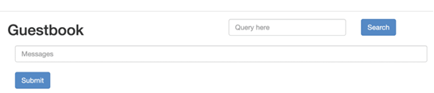
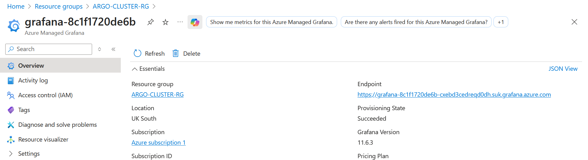
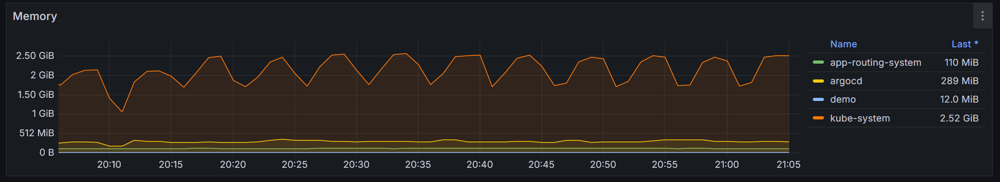
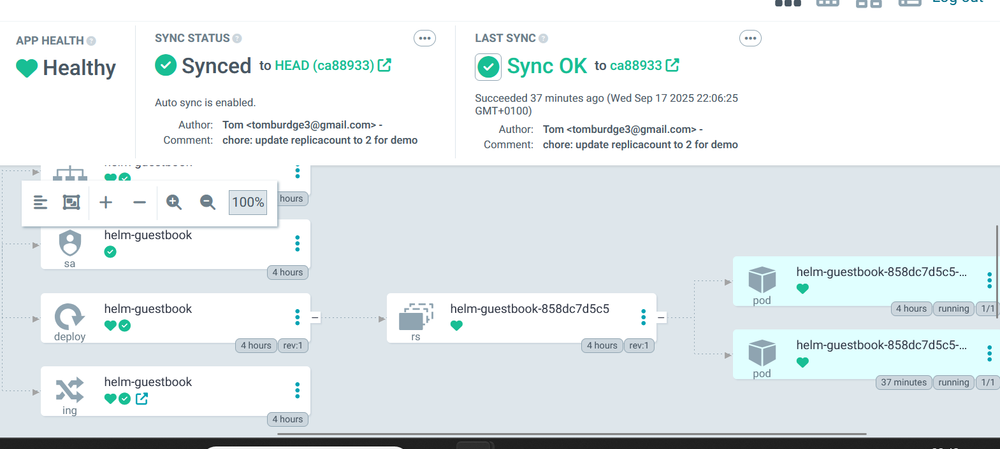

# README

Terragrunt code and charts for deploying GitOps ArgoCD helm charts to an Azure Kubernetes Service cluster with managed Prometheus and Grafana monitoring.

---

The below is a in-terminal demo of ArgoCD syncing a change from the helm chart deployed with terragrunt.


Argo CD orchestrates creation of a new pod auto-magically when I push an increase of replicaCount in the associated helm chart to the main branch.

---

## Table of Contents

* 1 How to deploy
* 2 Verification steps
* 3 Short demo

---

## 1 How to deploy

---

## 1.1 Azure subscription assumptions

* These resources are deployed to Microsoft Azure with AKS.
* To deploy these resources, various providers must first be registered on the azure subscription.
* There is a helper script in `scripts/grant-cluster-access.sh` which can be run in Linux with...

---

```bash
chmod +x ./scripts/register-extensions.sh
```

---

## 1.2 Local machine installation requirements

* [az CLI](https://learn.microsoft.com/en-us/cli/azure/install-azure-cli?view=azure-cli-latest)
* [kubectl](https://kubernetes.io/docs/tasks/tools/install-kubectl-linux/)
* [terraform](https://developer.hashicorp.com/terraform/install)
* [terragrunt](https://terragrunt.gruntwork.io/docs/getting-started/install/)
* Optional: [k9s](https://github.com/derailed/k9s) for monitoring the cluster in terminal.
* Optional: [mask](https://github.com/jacobdeichert/mask) for running commands (like Make but in markdown and easier to use).

Installation instructions linked in the bullet
points.

---

## 1.3 Local machine installation alternative

* There is a github action named `.github/workflows/terragrunt.yaml` which can be used to deploy the resources.
* If you have [act](https://github.com/nektos/act) and `docker` installed then you can run the deploy script without needing to use terraform.
* I have found `act` (and [VSCode docker containers](https://github.com/TomBurdge/rapid_onboarding)) useful when working in a restrictive VM which has access to docker.
* The github action needs secrets available for an Azure SP with an SP secret.
* Secrets can be passed to act from a `.env` file.
* There is a bash script at `scripts/create-sp.sh` to create an SP if it does not already exist.

---

## 1.4 Deploying the resources

* With terragrunt, you can deploy all the modules at once.
* To run locally:

```bash
az login

cd live/dev && terragrunt apply --all
```

---

* To run the github action with act:

```bash
# The secret file should contain:
# AZURE_CLIENT_ID=""
# AZURE_CLIENT_SECRET=""
# AZURE_SUBSCRIPTION_ID=""
# AZURE_TENANT_ID=""
act terragrunt --secret-file .env
```

---

## 2 Verification steps

---

## 2.1 Configure kubectl for the AKS cluster

In the azure portal, on the resource itself, azure gives helpful details for how to connect to the cluster:

```bash
az account set --subscription YOURSUBSCRIPTIONID
az aks get-credentials --resource-group ARGO-CLUSTER-RG --name argoaks --overwrite-existing
kubelogin convert-kubeconfig -l azurecli
```

---

## 2.2 Verify that the sample app is accessible via a Service/Ingress

Let's break this down into:

* Checking that the service is available via ingress.
* Accessing the service in browser.

---

### Checking for ingress in the namespace

The following checks that there is an ingress in the namespace where we deployed the `demo` app:

```bash
kubectl get ingress -n demo
```

The only thing deployed to this namespace is the guest helm chart, so the ingress is as part of that chart.

---

### Checking for accessibility in the browser

Here we can use http to access the app in the browser.

For simplicity, lets do so via the public IP:

```bash
# The public IP is in the azure nginx addon namespace
kubectl get svc -n app-routing-system
```

Then copy the IP from the table into the browser: `http:0.123.45.67`

---


---

### Side note: Serving with a DNS host and https

* I didn't implement the bonus for TLS/https serving.
* This is mainly because I didn't want to mess around with a my Windows host file/create a self-signed certificate manually.
* [This blog post](https://www.remiceraline.com/blog/aks-application-routing-addon-terraform-setup) included all the relevant details and I'm confident I could do it within another couple of hours.

---

## 2.3 Verify Prometheus Grafana UIs are reachable

* There is `prometheus-stack` release in the `archive` directory which can be moved to `live/dev` and to deploy the task.
* The example in `archive` uses a `helm_release` rather than an application via ArgoCD, but this would be straightforward to implement with another chart in `charts` and another call of the `argo-application` module.
* I favoured using a module that takes advantage of Azure's built-in support for managed Prometheus & Grafana.
* The benefit of these is that you can (quite easily) configure access to Grafana with azure RBAC and serve it via the Azure portal.

---

### Accessing the Azure Grafana instance

* You can go to the `Azure Managed Grafana` resource in the azure portal to find the managed grafana instance.
* When clicking on the `endpoint`, it can be used to see some dashboards with some basic metrics.



---

### Dashboard Screenshot Example

There is not much that is interesting in the dashboard, because the app is so small.
But here we can see the memory up and down that is the signature of a garbage collected language in the `kube-api` namespace:


---

## 3 Short demo


---
Finally, we can check that the ArgoCD works with GitOps by committing and pushing an update to the helm chart.

ArgoCD is deployed with the (preview) [Azure ArgoCD extension](https://learn.microsoft.com/en-us/azure/azure-arc/kubernetes/tutorial-use-gitops-argocd) rather than with a helm release.

---

### Steps to re-create the demo

* Change the `charts/guestbook/values.yaml` to have 2 rather than one replicas.
* Commit and push the change to the repo's main branch.
* Look at the namespace in k9s to see a pod spinning up or run `kubectl get pod -n demo`

---

### View the pod changing being made in the ArgoCD UI

* Or run the following commands and then you can open the ArgoCD UI in the browser.

```bash
kubectl get secret argocd-initial-admin-secret -n argocd \
  -o jsonpath="{.data.password}" | base64 -d; echo
echo 'Open at http://localhost:8080/'
kubectl port-forward svc/argocd-server -n argocd 8080:80---
```

* You can use the string printed to console as the password, and the username is `admin`.

---


---

## Run Through

Bottom-up:

* `_modules/`: just go through them quickly. Briefly mentioned the providers used.
* `charts/`: Quite straightforward. Just a `helm template` command pointing at the `guestbook` docker image.
  * Mention again that `archive` contains the helm template for `prometheus-stack` (did complete the task).
* `live`:
  * `terragrunt`: orchestrator for terraform (solves the single apply problem)
  * Briefly mention the DAG (I can see it from memory)

---

# Reflections

---

## What went well

* Single terraform apply. Benefit: fewer steps for developers to complete.
* Use of azure managed services (ArgoCD, Grafana). Benefit: use of managed services leads to (on aggregate) lower total cost of ownership.
* I like how the TUI demo looks. :)

---

## What I would refactor/change with more time

* I took the opportunity to write some tests in some of the `_modules`. I moved on, as it wasn't asked for in the task, but it would be essential for a live infra projectj to have a github action for some basic testing on a PR.
* I knew how to do the https serving bonus but skipped it due to time (blog post linked above).
* Removing some of the subscription hard-coding in the providers would be needed for multiple envs (this is relatively straightforward in terragrunt by registering the azurerm provider in the `root.hcl` with an environment switch).

---

## What I would refactor/change with more time

* There was more scope for configuring some custom dashboards (I realised after sticking to managed grafana that a custom dashboard would have been a little easier with a helm-native ArgoCD type workflow).
* AKS configuration on a private network  is much more complicated (and necessary in an enterprise setting). Not explicitly requested in task. I feel comfortable doing this type of work, it just takes longer:
  * ArgoCD syncing to a project
  * Application Gateway for secure serving
  * Subnets/vnet with right type of configs for any private endpoints ()
* Terragrunt is good for scaffolding code with `.boilerplate/` files in the modules rather than creating the `terragrunt.hcl` file oneself. You can `scaffold` the code with `terragrunt scaffold` (we use this with `just`) or `backstage`. Not needed for this small project, but becomes important in larger projects with terragrunt because terragrunt leans toward being so modular.

---

## Questions

* I did a single apply with terragrunt. Is/how is a single apply possible with terraform?
* The provider auth is only known after apply of the aks, so it  seemed to me that configuring the kubernetes/helm terraform provider without the AKS deployed yet would be quite a challenge.
